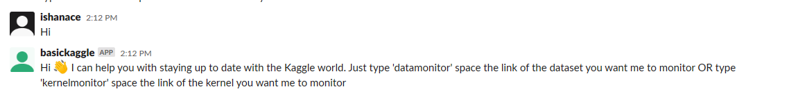
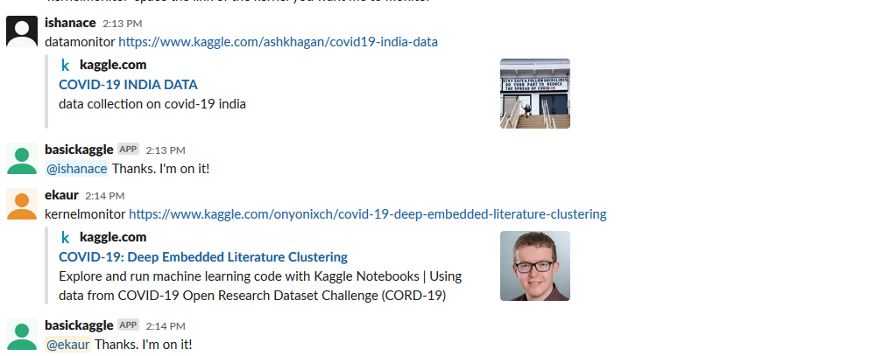
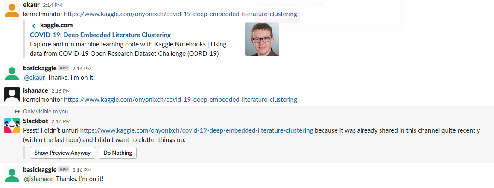
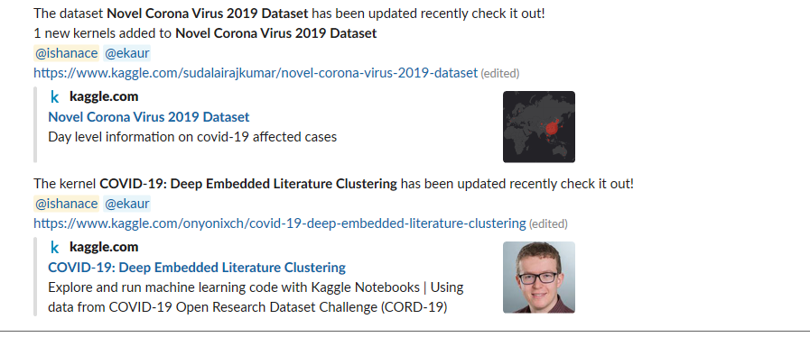

# SlackKaggleBot
This is a Slack Bot that integrates Kaggle APIs to notify users of updates to any kernels or datasets they choose to follow
Note: Currently working on integrating comments/discussions, deployment. Shoulde be pushed soon. Stay tuned!

Functionality
-----------
The slack bot needs to be invited to a channel. Thereon, it begins monitoring that channel. Any normal text/question will be responded with a simple how to. There are two main operations the bot supports : monitoring of kernel and monitoring of datasets. Each user can separately subscribe to updates on the required kernels/datasets. The bot will push the updates to the channel (for everyone to see) as well as notify the respective user who requested the updates. The schedule currently is to check for updates every hour using Kaggle APIs

In addition to performing the basic aforementioned tasks I believe this app is also a great starting point to build on Kaggle's API

Let's see the app in action

The bot greets you with instructions

</img>

Follow the instructions to track kernels/datasets

</img>

One user can track many links and the same link can also be tracked by many users!

</img>

The Celery + RabbitMQ Scheduler will automatically check for new updates every hour and inform you as shown below:

</img>

How to Run
-----------

